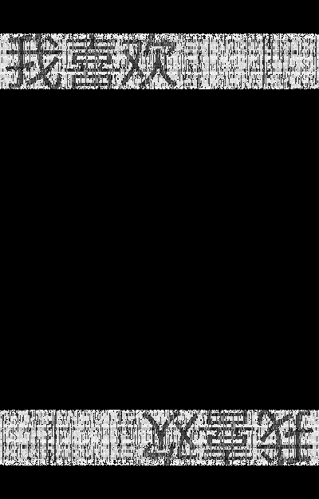
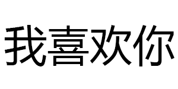
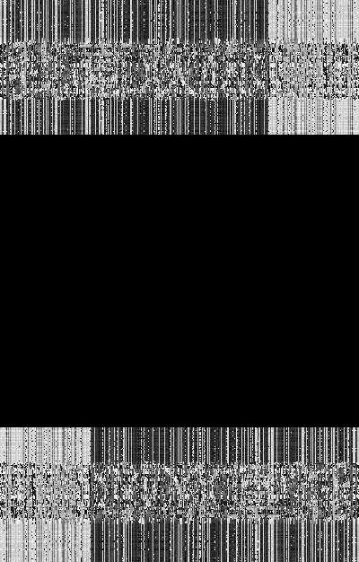

# BlindWaterMark

盲水印 by python

### 文件说明

* bwm.py 程序文件    python2版本
* bwmforpy3.py 程序文件    python3版本
* hui.png 无水印的原图
* wm.png 水印图
* wm_py3.png 水印图(py3测试)
* hui_with_wm.png 有盲水印的图
* hui_wm_py3.png 有盲水印的图(py3测试)
* wm_from_hui.png 反解出来的水印图
* wm_out_py3.png 反解出来的水印图(py3测试)

### Demo(python3)

合成盲水印图

    python bwmforpy3.py encode hui.png wm_py3.png hui_wm_py3.png

<div style="display: flex; align-items: center; justify-content: center; gap: 20px;">
  
  <span style="font-size: 24px;">+</span>
  
  <span style="font-size: 24px;">→</span>
  
</div><br>

提取图中的盲水印 (需要原图)

    python bwmforpy3.py decode hui.png hui_wm_py3.png wm_out_py3.png

<div style="display: flex; align-items: center; justify-content: center; gap: 20px;">
  
  <span style="font-size: 24px;">+</span>
  
  <span style="font-size: 24px;">→</span>
  
</div><br>

### install dependency

```bash
pip install -r requirements.txt
```

### Usage

注意程序python2和python3版本的加解密结果会有所不同，主要原因是python2和python3 random的算法不同，如果要让python3兼容python2的random算法请加 --oldseed参数。


Note that the encode and decode results of the python2 and python3 versions of the program will be different. The main reason is that the python2 and python3 random algorithms are different. If you want to make python3 compatible with the random algorithm of python2, please add the --oldseed parameter.

    Usage: python bwm.py <cmd> [arg...] [opts...]
      cmds:
        encode <image> <watermark> <image(encoded)>
               image + watermark -> image(encoded)
        decode <image> <image(encoded)> <watermark>
               image + image(encoded) -> watermark
      opts:
        --debug,          Show debug
        --seed <int>,     Manual setting random seed (default is 20160930)
        --oldseed         For python3 to use python2 random algorithm.
        --alpha <float>,  Manual setting alpha (default is 3.0)

### Demo(python2)

合成盲水印图

    python bwm.py encode hui.png wm.png hui_with_wm.png

<div style="display: flex; align-items: center; justify-content: center; gap: 20px;">
  
  <span style="font-size: 24px;">+</span>
  
  <span style="font-size: 24px;">→</span>
  
</div><br>

提取图中的盲水印 (需要原图)

    python bwm.py decode hui.png hui_with_wm.png wm_from_hui.png

<div style="display: flex; align-items: center; justify-content: center; gap: 20px;">
  
  <span style="font-size: 24px;">+</span>
  
  <span style="font-size: 24px;">→</span>
  
</div><br>


